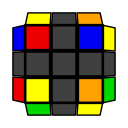
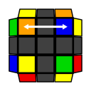
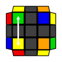

<link href="https://fonts.googleapis.com/css?family=Source+Sans+Pro&display=swap" rel="stylesheet">

 
R U R' U R U2 R'

 
L' U2 L U2 L F' L' F

 
F R' F' R U2 R U2 R'

 
U' R U R' U R U' R D R' U' R D' R2

 
R U' L' U R' U' L

 
U2 R U R' U R' F R F' R U2 R'

 

 
R U2 R' U' R U R' U' R U' R'

 
U' R U R' U R U L' U R' U' L

 
U R U2 R2 F R F' U2 R' F R F'

 
F R U R' U' R U R' U' R U R' U' F'

<a href="http://cube.crider.co.uk/visualcube.php?fmt=svg&pzl=3&view=plan&fd=ununnnunurnrrrrrrrfnfffffffdddddddddlnlllllllbnbbbbbbb&ac=pink&case=U2%20R%20U%20R%27%20U%20R%27%20F%20R%20F%27%20R%20U2%20R%27&arw=U2U0-s7,U9U2-s7,U0U9-s8">example image</a>

